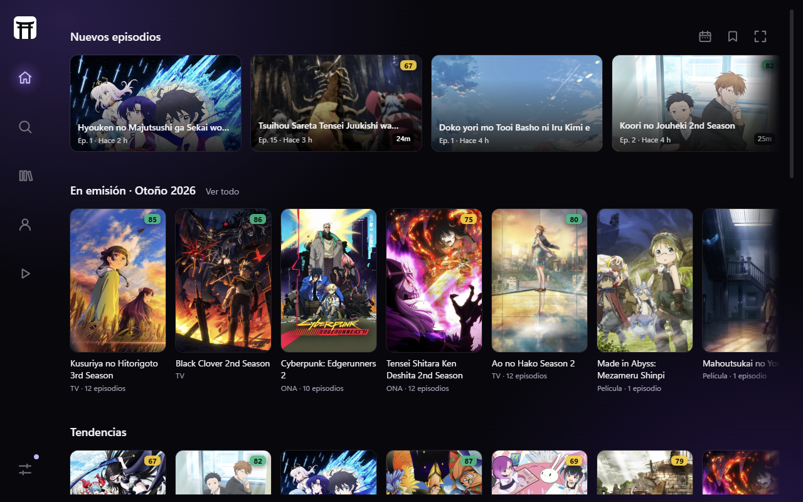
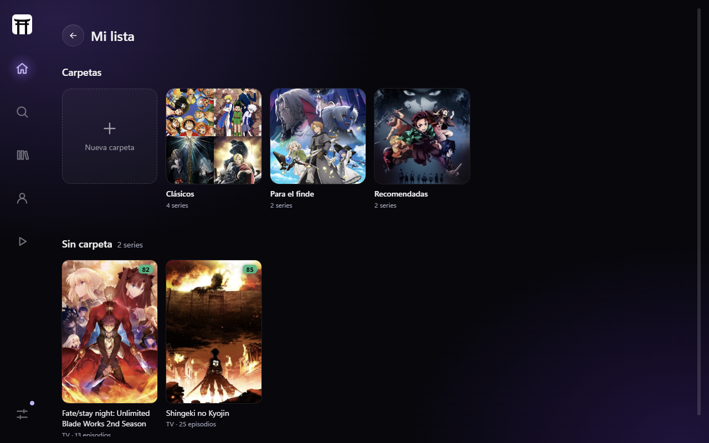

  

<h1 align="center">Torii</h1>

  App gratuita para Windows para llevar tu anime: catálogo con fichas y episodios, tu biblioteca sincronizada con AniList o MyAnimeList, y un reproductor propio.

  <a href="https://github.com/torii-app-zz/torii-releases/releases/latest"><b>Descargar la última versión</b></a>

Torii no trae contenido ni fuentes: reproduce tus archivos o lo que agregues vos.

## Capturas

| Ficha de cada serie | Calendario |
| --- | --- |
|  |  |

| Mi lista, con carpetas |
| --- |
|  |

## Descargar

Bajá `Torii_<versión>_x64-setup.exe` de la [última versión](https://github.com/torii-app-zz/torii-releases/releases/latest).

Funciona en Windows 10 y 11 de 64 bits, en español o en inglés.

## Instalar

1. Abrí el instalador.
2. Si aparece "Windows protegió su PC" (el instalador todavía no está firmado), tocá **Más información** y después **Ejecutar de todas formas**.
3. Seguí los pasos. Si a tu Windows le falta WebView2, el instalador lo baja.

Torii se actualiza sola: cuando hay una versión nueva, te avisa.

## Legal

Los términos de uso y la política de privacidad están en la app, en Ajustes → Información.

Contacto: toriiappzz@gmail.com
